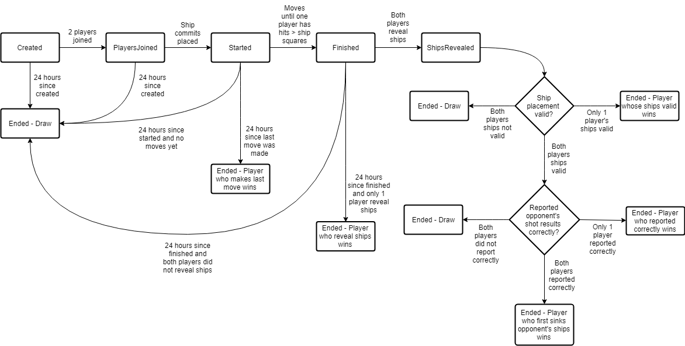

# Battleship DApp Readme
This project implements a Battleship game in Solidity. It comprises of the required contracts and a web UI.

## Description
This project implements a Battleship game using the commit-reveal pattern to avoid placing sensitive information (ship positions) in the blockchain.

The contract code is configured to set up game similar to that of rules linked on the [Wikipedia page](https://en.wikipedia.org/wiki/Battleship_(game)). It sets up a 10 x 10 board with the following ships:
- 1 x ship of length 5 (Carrier)
- 1 x ship of length 4 (Battleship)
- 2 x ship of length 3 (Destroyer, Submarine)
- 1 x ship of length 2 (Patrol Boat)

To simplify the UI, the game takes several liberties with the game. For example:
- The ship names do not appear in the UI, but the ship lengths are indicated and ships are assigned numbers (1 to 5) in the UI.
- In the real game, you call out a shot and the opponent responds with whether it was a Hit or Miss. The opponent then subsequently calls our his/her shot. In this game, however, the two are combined into one transaction so that only one transaction needs to be signed.

The game implements a simple betting system. Players specify a bet amount for each game when it is created. Both players need to put in the bet amount if they chose to join the game. If a player is found cheating or refusing to finish the game, the other player wins the entire prize pool. However, if both players play the game properly till the end, the winner gets 90% and the loser the remaining 10%. This is to incentivize players to play till the end (and reveal the ship positions). Otherwise, players may just choose to stop playing shortly before the game ends if they think they have lost.

The game itself currently stores each shot to the blockchain. While this is quite inefficient, I do not know how to not require doing so, and yet ensure players don't cheat and say that they did not call a shot they actually did.

The game uses a state machine pattern to track the various states of the game. Here's a diagram to illustrate the flow of the game states:

## Try it out
You can access the UI for the game here: http://kaiyao-battleship-dapp.s3-website-us-east-1.amazonaws.com

The Lobby contract can be found on the Rinkeby testnet at:
0x06574ca6e7d4516edfeb7452651d719b2d10d62b

You can see the contract code (combined into one big file) and interact with it on Etherscan:
https://rinkeby.etherscan.io/address/0x06574ca6e7d4516edfeb7452651d719b2d10d62b

The combined code is generated using [solidity-flattener](https://github.com/BlockCatIO/solidity-flattener). The command used can be found in `solidity-flattener-cmd`.

The Battleship contract is deployed when a new game is created. You can see the list of games in the UI (the ID is the contract address).

## Getting Started
To run it, please do the following:
- Ensure you have truffle and ganache-cli installed (as well as all related dependencies like node, npm, etc.).
- Start ganache-cli in one command line window.
- In another command line window, do the following:
  - `git clone` this repository
  - change to the directory where the code is in
  - run `npm install` to install the dependencies
  - run `truffle compile`
  - run `truffle migrate`
  - run `truffle test` to run the tests
  - run `npm run dev` to launch the server and browser

## Code Structure

The entire folder structure was originally based on the [Truffle pet shop tutorial](https://truffleframework.com/tutorials/pet-shop).

The contract code is in the directory `contracts`. The code for the Battleship game is implemented as two contracts:
1. The Lobby (`Lobby.sol`): players can create new games, join games with only 1 player, switch games, etc.
2. The Game itself (`Battleship.sol`): players place their bets, place their ships, make shots, etc.

There is a third contract, `BattleshipTest.sol` that contains additional functions used only in the automated tests.

The UI for the entire DApp is inside `src/index.html` and `src/js/app.js`.

## Troubleshooting

### Common issues
- Sometimes, the first time the page loads in Chrome, there are some Metamask errors (which you can see in the Chrome developer console). Just try to refresh the page and it should work the 2nd time.
- If there are any issues with the page, try to refresh the page. It should remember the last game you were in.
- This app uses localstorage in the browser to store the positions of the ships before they are revealed at the end of the game. If you are using a browser or plugin that blocks localstorage, this can cause the app to not work (e.g. if you are using Brave browser, you need to disable site shield for the page to allow localstorage).
- The final withdrawal of winnings/refunds seems to require more gas that what MetaMask estimates by default which causes the transaction to fail (it says revert in the Chrome developer console). You need to set this gas value manually.

### Reset all stuff
Sometimes, things just don't work (out of sync, "the tx doesn't have the correct nonce", or whatever). When this happens, this is what I do:
- close and restart ganache-cli
- `truffle compile`
- `truffle migrate --reset`
- `npm run dev`
- in the MetaMask extension, for all the test accounts used, click on the 3 lines icon at the top right -> Settings -> Reset Account
- refresh the page in the browser and try again

## Tests
The tests are contained in `tests/lobby.js` and `tests/battleship.js`. Each tests the corresponding contract. Javascript tests are used instead of Solidity tests because the game requires testing the interaction between multiple accounts, which does not appear to be possible with Solidity tests at the moment.

Some of the test cases in `battleship.js` use a contract `BattleshipTest.sol`. This is to minimize the size of the `Battleship.sol` contract, which was exceeding the max contract size. This contract inherits the main Battleship.sol contract and adds a few functions that are only used during testing - batch actions, changing time, etc.

The tests aim to test the various scenarios/flows of the whole game, and that the contract enforces the game rules. E.g. 
 - test that you must take turns to make a shot
 - test that you must submit the result of the previous shot before making a new shot
 - test that overlapping ships are detected (and player loses)
 - test that incorrectly reported shops are detected (and player loses)
 - test that player can end game if the game takes too long (prevent DoS attack)
 - etc.

Each test has a one-line description to describe what it is checking for. Please refer to the test output and/or the test code (see the `contract` and `it` messages).

Note that `truffle test` takes some time to run (~ 1 minute on my computer), and some of the tests may take some time (20 seconds or so). This is normal as some of the tests involve simulating an entire battleship game with 20+ moves per player. Some shortcut functions have been created in `BattleshipTest.sol` in order to minimize the automated test time.

## UI Manual Testing

### Testing interactions with two browsers/computers

#### Dev Server/Browser
The dev server has been configured to listen on 0.0.0.0 port 3000, this allows you to open the URL on another browser/computer/VM (go to `http://<your ip>:3000/` to visit the same page and interact as two different players).

Lite-server is used as the dev server (same as in pet shop tutorial) but the following changes have been made:
- Listen on 0.0.0.0
- Ghost mode is off by default

Ghost mode is normally on by default and it syncs clicks etc. which messes things up (since each player is supposed to do their own stuff rather than the same actions). If you need to change it go to localhost:3001 to access the browsersync configuration. Then click "Sync Options" on the left, and click "Disable All" to disable all synchorization.

I have only tried the app in Chrome 68. Please try to use Chrome if you have problems with other browsers.

#### MetaMask
Obviously, MetaMask must be configured to use the same Custom RPC (`http://<your ip>:8545`) for both browsers to be on the same private network and interact with each other.

MetaMask must also be using the same seed words on both browsers to interact with ganache-cli.

MetaMask must also be using a different account (click the icon near the top right of the Metamask popup - the one with the human icon and two arrows around it) and click "Create Account".

One browser thus should be using "Account 1", and the other browser should be using "Account 2".

If successfully set up, you should be able to start a game on one browser and join the game on the other browser.

If you switch accounts in MetaMask, you will need to refresh the page.

### Changing game parameters

Should you wish to look at the UI and play the game to the end, it may take a long while to complete one normal game. You can try to reduce the number of ships and length of ships in the game by changing the variables at the top of `Battleship.sol` to reduce the time taken to try out one game.

Once changed, you may need to redeploy and reset everything (see the "Reset all stuff" section above). This is because the Lobby deploys a new Battleship contract for each game and old contracts will still be on the blockchain if you do not reset everything.

Don't forget to change the values back (and redeploy) after testing as the unit tests depend on the default values.

## Libraries/EthPM
The [OpenZeppelin](https://github.com/OpenZeppelin/openzeppelin-solidity) library is used in the code. Specifically, the `OnlyOwner`, `PullPayments` and `SafeMath` libraries are used.
Even though there is an ethpm.json the version of OpenZeppelin in ethpm is much older than the version in npm. Hence the npm install is used instead.

## Design Pattern Decisions
Please see [design_pattern_decisions.md](design_pattern_decisions.md)

## Avoiding Common Attacks
Please see [avoiding_common_attacks.md](avoiding_common_attacks.md)

